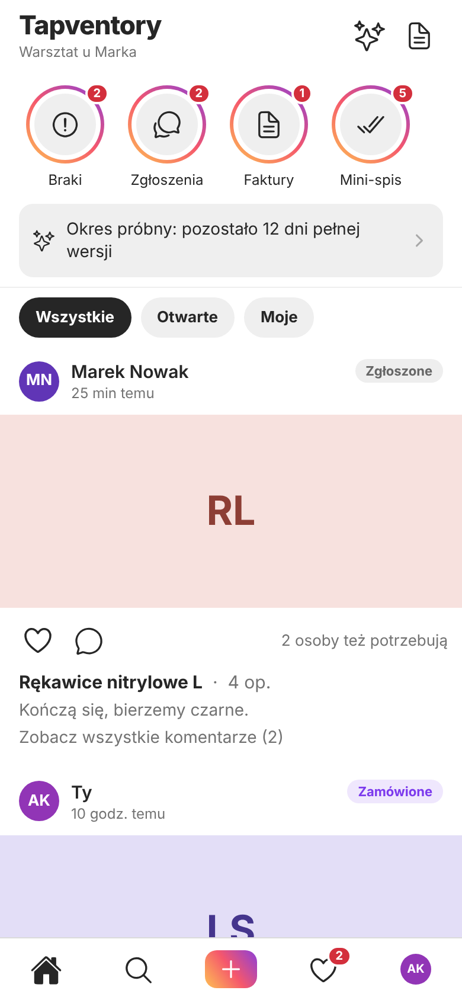
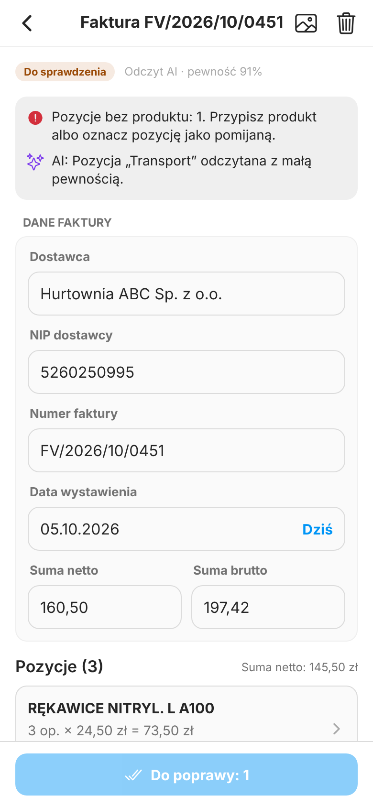
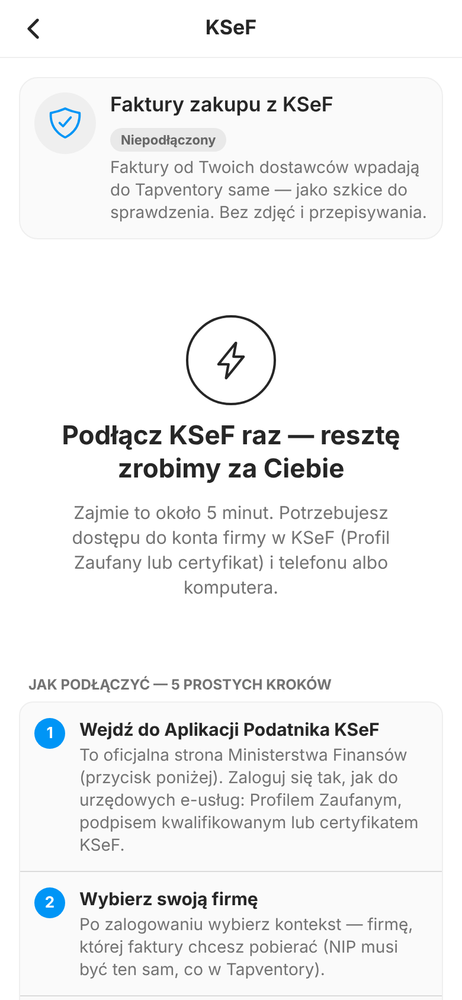

# Tapventory

**Magazyn i zakupy dla małych firm usługowych (do 10 osób)** — warsztaty, salony, gabinety, gastronomia, ekipy remontowe.
Jedna aplikacja na **iPhone’a, Androida i przeglądarkę (PWA)**, w stylu Instagrama, z backendem na Supabase.

<p>
  
  
  
</p>

## Co potrafi

* **„Zdejmij” w 2 dotknięcia** (albo skanem kodu kreskowego) — pracownik odpisuje zużycie szybciej niż karteczką; stan to suma ruchów, nic nie ginie.
* **Zgłoszenia braków** jak posty: zdjęcie, ilość, statusy (zgłoszone → zaakceptowane → zamówione → dostarczone → przyjęte), czat w wątku, serce „ja też tego potrzebuję”.
* **Faktury zakupu:** ze zdjęcia/PDF czyta je **AI (Claude)**, a **kod sprawdza** sumy i NIP; z państwowego **KSeF** wpadają same. Człowiek zatwierdza, nic nie księguje się automatycznie; błąd cofa „storno”.
* **Mini‑spisy** zamiast wielkiej inwentaryzacji, role (właściciel / kierownik / pracownik), plany i limity, zgoda na AI, usuwanie konta, asystent „jak to zrobić”.
* **Bezpieczeństwo w bazie:** izolacja danych firm wymuszona regułami RLS, 117 testów na prawdziwym PostgreSQL 16 i 17.

## Status (9.10.2026) — uczciwie

Etap 1 jest w większości zbudowany i przetestowany **automatycznie**. **Nie sprawdzono na żywo:** Supabase w chmurze, KSeF, modeli AI, budowy natywnej i sklepów. Brakuje m.in. płatności (Stripe) i strony www, 2FA, trybu offline.
Pełny raport: [`docs/05_RAPORT_WERYFIKACJI.md`](docs/05_RAPORT_WERYFIKACJI.md) • co dalej: [`docs/01_KOLEJKA_BUDOWY.md`](docs/01_KOLEJKA_BUDOWY.md).

## Start (Windows, bez Dockera, ~1,5 godziny do działającej aplikacji w przeglądarce)

1. Przeczytaj [`docs/00_INSTRUKCJA_BUDOWY_ETAPAMI.md`](docs/00_INSTRUKCJA_BUDOWY_ETAPAMI.md) — krok po kroku od pustego komputera, z punktami kontrolnymi.
2. W skrócie (po zainstalowaniu Node 24 LTS i Gita oraz założeniu projektu Supabase):

   ```powershell
   git clone -b claude/tapventory-completion-6e1k9f https://github.com/marlow3189/Tapventory.git C:\projekty\tapventory
   cd C:\projekty\tapventory
   npm install
   npx supabase login
   npx supabase link --project-ref TWOJ_REFERENCE_ID
   npx supabase db push
   cd mobile
   npm install
   Copy-Item .env.example .env        # wpisz URL i klucz PUBLICZNY projektu Supabase
   npm run web                        # http://localhost:8081
   ```

3. Coś nie działa? [`docs/14_RATOWNIK.md`](docs/14_RATOWNIK.md).

## Mapa dokumentacji

| Dokument | Po co |
|---|---|
| [`docs/00_INSTRUKCJA_BUDOWY_ETAPAMI.md`](docs/00_INSTRUKCJA_BUDOWY_ETAPAMI.md) | **start tutaj**: od komputera do aplikacji w przeglądarce, na Androidzie i iPhonie |
| [`docs/01_KOLEJKA_BUDOWY.md`](docs/01_KOLEJKA_BUDOWY.md) | co zrobione, co dalej, zadania po Twojej stronie |
| [`docs/02_START_LOKALNY.md`](docs/02_START_LOKALNY.md) | środowiska: chmura vs lokalnie, sieć telefon–komputer, wdrożenie funkcji, ręczna zmiana planu |
| [`docs/03_ARCHITEKTURA_I_BEZPIECZENSTWO.md`](docs/03_ARCHITEKTURA_I_BEZPIECZENSTWO.md) | jak to jest zbudowane i dlaczego; zasady pisania funkcji w bazie |
| [`docs/04_RYNEK_I_TECHNOLOGIE.md`](docs/04_RYNEK_I_TECHNOLOGIE.md) | badanie rynku, OCR/AI, wymagania sklepów — ze znacznikami wiarygodności |
| [`docs/05_RAPORT_WERYFIKACJI.md`](docs/05_RAPORT_WERYFIKACJI.md) | co sprawdziłem, co znalazłem (F1–F10 i dalsze), czego nie sprawdziłem |
| [`docs/06_TESTY_I_JAKOSC.md`](docs/06_TESTY_I_JAKOSC.md) | wszystkie polecenia testów, CI, jak pisać testy |
| [`docs/07_UI_I_STYL.md`](docs/07_UI_I_STYL.md) | system projektowy w stylu Instagrama, dostępność, test dymny |
| [`docs/09_AI_I_OCR.md`](docs/09_AI_I_OCR.md) | odczyt faktur, kontrola kodem, koszty, **pomiar jakości w produkcji** |
| [`docs/10_KSEF.md`](docs/10_KSEF.md) | integracja z KSeF, instrukcja dla klienta, lista kontrolna testu na żywo |
| [`docs/12_BUDOWANIE_I_PUBLIKACJA.md`](docs/12_BUDOWANIE_I_PUBLIKACJA.md) | EAS, Android, iPhone, sklepy, prywatność, recenzje |
| [`docs/13_PWA_I_POWIADOMIENIA.md`](docs/13_PWA_I_POWIADOMIENIA.md) | PWA: hosting, domena, instalacja, ograniczenia, powiadomienia |
| [`docs/14_RATOWNIK.md`](docs/14_RATOWNIK.md) | objaw → przyczyna → lek |
| [`docs/prawne/`](docs/prawne/README.md) | szablony: polityka prywatności, regulamin, usunięcie konta, umowa powierzenia (**wymagają prawnika**) |
| [`docs/Tapventory_dokument_koncepcyjny_v1.md`](docs/Tapventory_dokument_koncepcyjny_v1.md) | koncepcja produktu (wersja 1.2) ze stanem realizacji |
| [`CLAUDE.md`](CLAUDE.md) | zasady dla programistów i asystentów AI pracujących w tym repozytorium |

## Mapa katalogów

```
mobile/                aplikacja Expo (iOS, Android, PWA): src/app (ekrany, Expo Router), src/components, src/lib, src/theme, public (PWA)
supabase/
  migrations/          schemat bazy + RLS + funkcje (0001…0014; po wgraniu nietykalne)
  functions/           Edge Functions: process-document, assistant, barcode-lookup, ksef-connect, ksef-sync, send-push, cron-tasks
  tests/               117 testów bazy na prawdziwym PostgreSQL
  config.toml          konfiguracja lokalnego Supabase i funkcji
  seed.sql             dane przykładowe — tylko lokalnie
eval/                  zestaw ewaluacyjny odczytu faktur (28 syntetycznych dokumentów)
docs/                  dokumentacja (powyżej), szablony prawne, zrzuty ekranów
.github/workflows/     CI (baza, funkcje, Deno, aplikacja, interfejs)
```

## Zasady, których pilnujemy

* Bezpieczeństwo danych mieszka w **bazie (RLS)**, nie w kodzie aplikacji.
* **Migracja raz wdrożona jest nietykalna** — poprawki to nowe pliki.
* Ruchy magazynowe są **tylko‑do‑dopisywania**; stan to suma ruchów; błędy cofa się storno.
* Klucze `service_role`, Anthropic i szyfrujący KSeF **nigdy** nie trafiają do aplikacji ani do repozytorium.
* AI **czyta**, a kod **sprawdza**; nic nie księguje się bez człowieka.
