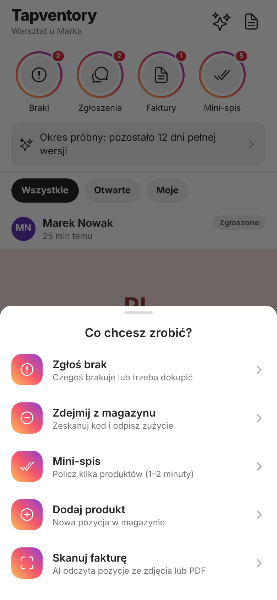
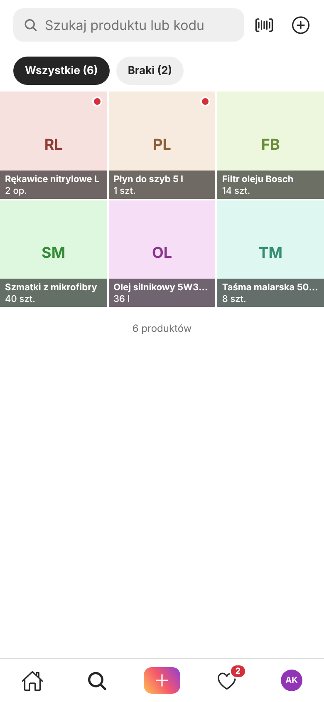
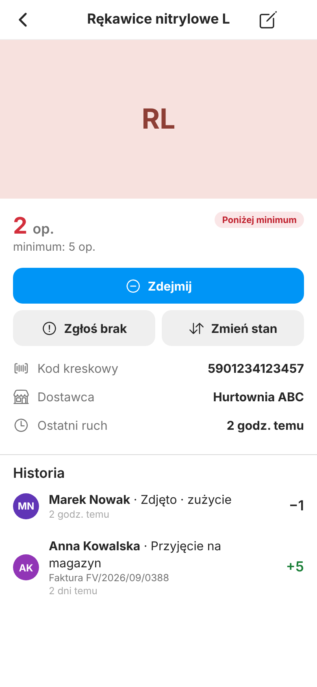
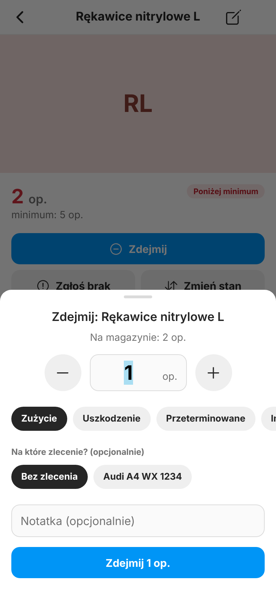
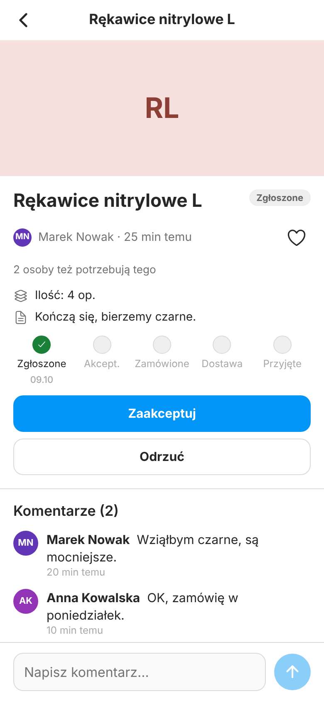
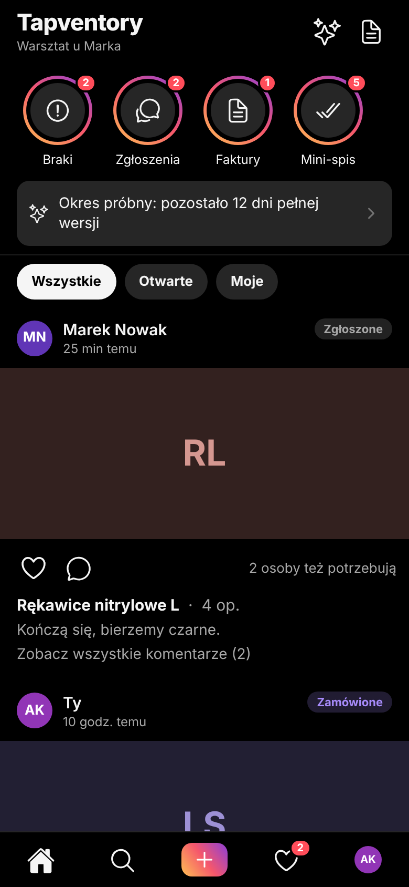
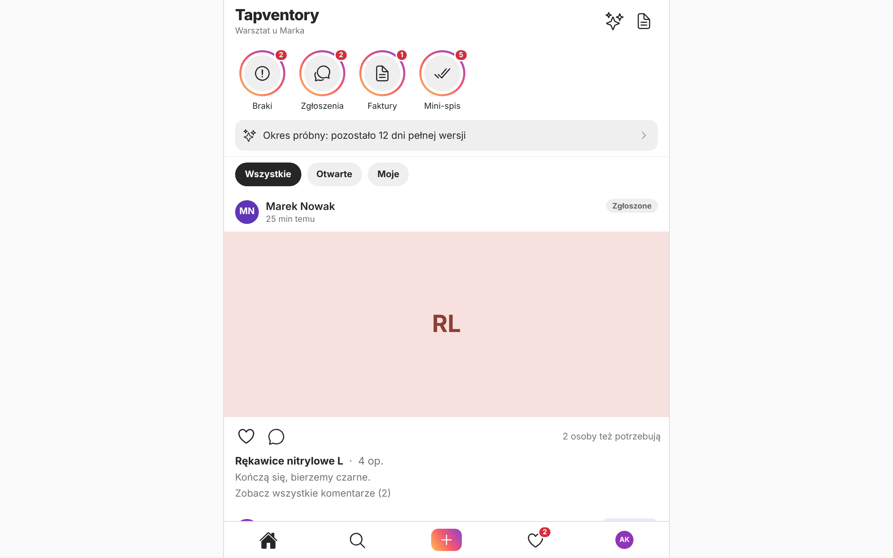

# 07 — Interfejs i styl (w duchu Instagrama)

> Zrzuty ekranów w tym dokumencie pochodzą z testu dymnego w prawdziwym Chromium na **makiecie backendu** (dane są zmyślone). Wygląd na prawdziwych telefonach (iOS/Android) nie był sprawdzany.

## 1. Zasada

**Instagram jest wzorem rytmu i układu, nie marką do skopiowania.** Bierzemy: białe tło i cienkie linie, duże zdjęcia, ikony „outline”, dolny pasek ze środkowym „＋”, okrągłe *stories*, karty w feedzie z sercem i komentarzami, arkusze wysuwane od dołu.
Nie bierzemy: logo, nazw, zasobów graficznych Instagrama (to znak towarowy Meta). Kolor akcji `#0095F6` i czerwień serca to zwykłe barwy; **pierścień stories (bursztyn → koral → fiolet) jest nasz**.

Dlaczego takie podejście ma sens biznesowy: pracownik warsztatu czy salonu zna ten język z własnego telefonu — nie trzeba go uczyć. „Stories” to **zadania na dziś**, „posty” to **zgłoszenia braków**, „serce” to **„ja też tego potrzebuję”**.

## 2. Mapa ekranów

| Ekran | Ścieżka w kodzie (`mobile/src/app/…`) | Kto widzi | Zrzut |
|---|---|---|---|
| **Start** (stories + feed zgłoszeń) | `(app)/(tabs)/home.tsx` | wszyscy |  |
| Arkusz „＋” (szybkie akcje) | `components/CreateSheet.tsx` | wszyscy (dodawanie produktu i skan faktury tylko kierownictwo) |  |
| **Magazyn** (siatka produktów, szukanie) | `(app)/(tabs)/explore.tsx` | wszyscy |  |
| Produkt (stan, historia ruchów, „Zdejmij”) | `(app)/product/[id].tsx` | wszyscy |  |
| „Zdejmij z magazynu” (2 dotknięcia) | `components/TakeSheet.tsx`, `(app)/scan.tsx` | wszyscy |  |
| Zgłoszenie (statusy, czat, „ja też”) | `(app)/request/[id].tsx` | wszyscy |  |
| Dodaj/edytuj produkt | `(app)/product/edit.tsx` | kierownictwo | |
| Nowe zgłoszenie | `(app)/request/new.tsx` | wszyscy | |
| Mini‑spis | `(app)/count.tsx`, `components/CountPrompt.tsx` | wszyscy | |
| Skan faktury, lista i szczegóły dokumentów | `(app)/documents/*` | kierownictwo |  |
| Aktywność (powiadomienia) | `(app)/(tabs)/activity.tsx` | wszyscy | |
| Profil, zespół, zaproszenia | `(app)/(tabs)/profile.tsx`, `(app)/team/*` | wszyscy / kierownictwo | |
| Ustawienia (plan, mini‑spisy, zlecenia, zgoda AI, usuwanie konta) | `(app)/settings/index.tsx` | wszyscy / kierownictwo | |
| KSeF (kreator tokenu, stan, historia) | `(app)/settings/ksef.tsx` | kierownictwo / właściciel łączy |  |
| Asystent AI | `(app)/assistant.tsx` | wszyscy | |
| Logowanie, rejestracja, reset hasła, wybór „firma / kod”, tworzenie firmy, dołączanie kodem | `(auth)/*`, `(onboarding)/*`, `create-company.tsx`, `join.tsx` | niezalogowani / nowi | |

Tryb ciemny (zgodnie z ustawieniem systemu) i widok komputera (PWA, treść do 640 px szerokości):

 

## 3. System projektowy (jedno źródło prawdy: `mobile/src/theme/tokens.ts`)

**Żaden ekran nie wymyśla własnych kolorów ani rozmiarów** — dzięki temu wygląd jest spójny, a tryb ciemny to zmiana jednego miejsca.

| Element | Wartości |
|---|---|
| Kolory | `bg`, `bgSecondary`, `surface`, `border`, `fill`, `text`, `textSecondary`, `textTertiary`, `primary` (`#0095F6`), `danger`, `success`, `warning`, `info`, `violet` — osobno jasny i ciemny zestaw; do użycia przez `useColors()` |
| Gradient marki | `#FEC053 → #F5576C → #8B3FD9` (pierścienie stories, przycisk „＋”, ikona aplikacji) |
| Typografia | `largeTitle` 28, `title` 22, `headline` 17, `body` 15, `callout` 14, `subhead` 13, `footnote` 12, `caption` 11 |
| Odstępy | siatka 4 pt: 2, 4, 8, 12, 16, 24, 32 |
| Zaokrąglenia | 8, 12, 16, „pigułka” |
| Układ | element dotykowy ≥ **44 pt**, pasek zakładek 52, stories 66, maks. szerokość treści 640 |

Komponenty (`mobile/src/components/ui`): `Screen`, `Text`, `Button`, `Chips`, `TextField`, `ListRow`/`Section`, `Sheet` (arkusz od dołu), `Dialogs` (`useDialogs()`: `toast`, `confirm`, `fail`), `Pill`/`CountBadge`, `Avatar`, `StoryBubble`, `QtyStepper`, `SignedImage` (zdjęcia z podpisanych linków), `Skeleton` (szkielet ładowania), `States` (puste/błąd/ładowanie), `OfflineBanner`, `Icon`, `Touchable`.
Komponenty domenowe: `StoriesRow`, `RequestCard`, `ProductTile`, `TakeSheet`, `CreateSheet`, `CountPrompt`, `AiConsentSheet`, `PhotoPicker`, `ManualMovementSheet`, dokumenty: `LineEditorSheet`, `ProductPickerSheet`.

### Reguły dla piszącego ekran

1. Kolory **tylko** z `useColors()` i `Text color="…"`; żadnych `#RRGGBB` w ekranach.
2. Każdy ekran ma cztery stany: **ładowanie** (szkielet), **pusto** (komunikat + akcja), **błąd** (`friendlyError` → toast lub `States`), **brak sieci** (baner).
3. Zapis = `useMutation` + toast sukcesu/błędu + unieważnienie zapytań (`invalidateQueries`). Błędy bazy są po polsku (`P0001`) i pokazują się użytkownikowi bez „obróbki”.
4. Akcje zależne od roli ukrywaj (`isManager`, `isOwner` z `useTenant()`) — **ale i tak chroni je baza**; ukrycie to tylko wygoda.
5. Każdy element dotykowy ma `accessibilityLabel`; cel dotyku ≥ 44 pt (`layout.touch`).
6. Teksty: po polsku, krótko, bez żargonu; liczby i daty przez `lib/format.ts` (przecinek dziesiętny, `RRRR-MM-DD` ↔ `DD.MM.RRRR`).
7. Wibracja (haptyka) tylko przy potwierdzeniu czynności (`buzz`).
8. Nie dodawaj cen ani linków do płatności w widokach dostępnych na iOS (`docs/12_*`, rozdz. 5.4).

## 4. Dostępność — zmierzone kontrasty

Policzone według wzoru WCAG 2.x (próg AA: **4,5:1** dla tekstu normalnego, 3:1 dla dużego tekstu i elementów graficznych).

| Para kolorów | Przed | Po zmianie | AA |
|---|---:|---:|:-:|
| tekst główny `#262626` na białym | 15,1 | 15,1 | ✅ |
| tekst drugorzędny `#737373` na białym | 4,74 | 4,74 | ✅ |
| błąd (czerwień) na białym: `#ED4956` → `#D32F3C` | 3,69 | **4,95** | ✅ |
| sukces (zieleń) na białym: `#2EA44F` → `#1A7F37` | 3,21 | **5,08** | ✅ |
| ostrzeżenie (bursztyn) na białym: `#F59E0B` → `#B45309` | 2,15 | **5,02** | ✅ |
| fiolet na białym: `#8B5CF6` → `#7C3AED` | 4,23 | **5,70** | ✅ |
| kapsułki statusu (tekst na tle 12% koloru) | 1,96–4,09 | **4,59–5,23** (ciemniejsze kolory tekstu w jasnym motywie) | ✅ |
| placeholder pola tekstowego (`textTertiary` → `textSecondary`) | 2,38 | 4,74 | ✅ |
| **biały tekst na przycisku akcji `#0095F6`** | **3,17** | bez zmiany | ❌ (dozwolone tylko dla dużego/pogrubionego tekstu) |
| **tekst/ikony „akcent” `#0095F6` na białym** (np. „Dziś” w polu daty) | **3,17** | bez zmiany | ❌ |
| tekst trzeciorzędny `#A8A8A8` na białym (ikony, szewrony — elementy dekoracyjne) | 2,38 | bez zmiany | ❌ (nie używać do ważnego tekstu) |

Dwa znane odstępstwa (`#0095F6`) to świadoma decyzja: to „niebieski Instagrama”, który daje poznawalny wygląd. Jeśli zależy Ci na pełnym AA, zmień w `tokens.ts` `primary` jasnego motywu na `#0074CC` (4,81:1 z białym) — pamiętaj o ponownym przejściu testu dymnego.
Dark mode: tekst główny 19,3:1, drugorzędny 8,8:1 — bez uwag.

*Niesprawdzone:* czytniki ekranu (VoiceOver, TalkBack), powiększanie czcionek systemowych do maksimum, nawigacja klawiaturą w PWA. Dodaj to do przeglądu przed publikacją.

## 5. Ikony i grafiki aplikacji

Wszystkie ikony powstają z jednego wzoru: `npm run assets` (`mobile/scripts/generate-assets.mjs`, wymaga pakietu `sharp`, już w `devDependencies`) generuje ikonę iOS (1024×1024 bez przezroczystości), ikony adaptacyjne Androida (tło, pierwszy plan, jednokolorowa), ekran startowy, favicon i ikony PWA (192/512/maskable/apple-touch).
Aby podmienić logo: zmień kształt/kolory w skrypcie i uruchom go ponownie; reguły sklepów są opisane w komentarzu na początku pliku.

## 6. Test dymny interfejsu

`mobile/scripts/ui-smoke/` uruchamia prawdziwy Chromium w widoku telefonu na zbudowanej aplikacji webowej i **makiecie Supabase** (`mock-backend.mjs`). Przechodzi 8 ścieżek (logowanie i walidacje, Start i stories, Magazyn i produkt, zgłoszenia, faktury, mini‑spis i zespół, ustawienia i KSeF w kilku stanach, rola pracownika + ciemny motyw + widok komputera),
robi zrzuty i **kończy się błędem, jeśli w konsoli pojawi się jakikolwiek błąd**.

```powershell
cd C:\projekty\tapventory
npx playwright install chromium                 # raz
cd mobile
npm run build:web
cd ..
node mobile/scripts/ui-smoke/run.mjs mobile/dist ui-smoke-out
```

Zrzuty trafiają do `ui-smoke-out\` (folder jest w `.gitignore`). CI robi to samo i dołącza zrzuty jako artefakt.
Ograniczenie: to nie zastępuje testu na prawdziwym telefonie ani testu z prawdziwym backendem.

## 7. Co jeszcze warto w interfejsie (lista pomysłów)

* ekran „Dziennik zdarzeń” (dane są w `audit_log`, brak widoku),
* eksport CSV (stany, ruchy, faktury) — w koncepcji, niezrobione,
* raport „koszt materiałów na zlecenie” (dane są: ruchy i pozycje mają `project_id`),
* druk etykiet z kodami (konkurencja, np. Sortly, ma),
* ciągły skan wielu kodów pod rząd,
* animacje przejść i mikro‑interakcje (haptyka jest),
* przegląd dostępności z czytnikiem ekranu (patrz rozdz. 4).
